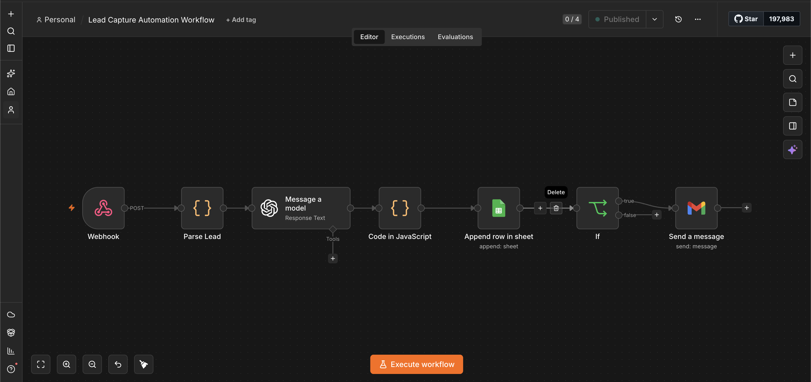

# Lead Capture Form

A static HTML lead capture form that posts submissions to an n8n webhook.

## n8n Workflow

The webhook receives the lead payload, parses it, enriches it with an LLM, appends it to a Google Sheet, and (conditionally) sends a Gmail notification.

**Flow:** Webhook → Parse Lead → Message a model → Code in JavaScript → Append row in sheet → If → Send a message

Webhook URL: `https://dipansrimany.app.n8n.cloud/webhook/lead-capture`

Google Sheet: https://docs.google.com/spreadsheets/d/13U_jIASuKAgH3QCrt-6V1gWOSGnnA0jAXjZ6U85CUcw/edit?usp=sharing
